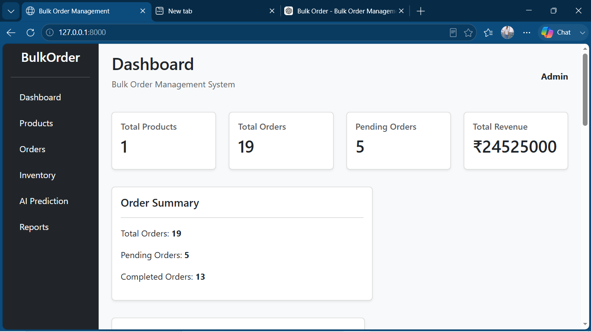
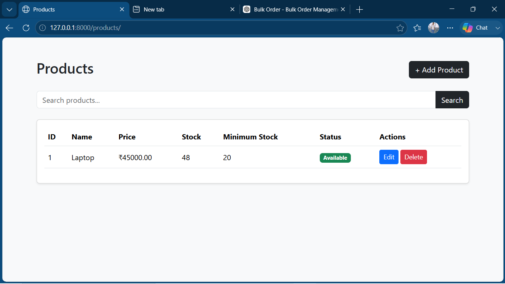
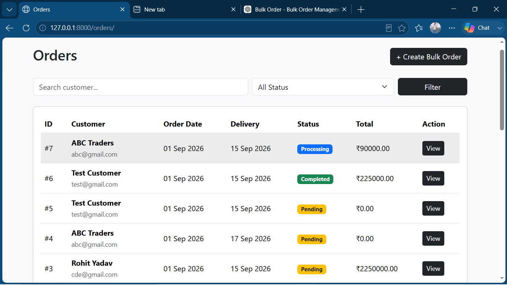

# Bulk Order Management System

A Django-based Bulk Order Management System with inventory management, order tracking, business analytics, and AI-powered demand prediction.

## Overview

The Bulk Order Management System is a web-based application designed to help businesses manage products, bulk orders, inventory, and future stock requirements from a single dashboard.

The system also includes an AI-based demand prediction module that analyzes historical order data and predicts future product demand.

## Features

### Product Management

- Add new products
- Edit product information
- Delete products
- Search products
- Track product price
- Track available stock
- Set minimum stock level
- Automatically identify low-stock products

### Bulk Order Management

- Create bulk orders
- Add multiple products to a single order
- Specify product quantities
- Automatic product pricing
- Automatic order total calculation
- Customer information management
- Delivery date management
- Order status management

### Inventory Management

- Automatic stock deduction after successful orders
- Stock availability validation
- Prevent orders when requested quantity exceeds available stock
- Low-stock detection
- Minimum stock level tracking
- Database transaction support for safe stock updates

### Order Management

- View all orders
- Search orders by customer
- Filter orders by status
- View complete order details
- Update order status
- View ordered products and quantities
- Calculate order subtotals and total amount

### Dashboard Analytics

- Total products
- Total orders
- Pending orders
- Processing orders
- Completed orders
- Cancelled orders
- Total revenue
- Low-stock products
- Order status analytics
- Monthly revenue analytics

## AI Demand Prediction

The system includes an AI-powered demand prediction module.

Historical order data is collected from the database and converted into monthly demand data.

The current ML pipeline works as follows:

```text
Historical Orders
       ↓
Order Items
       ↓
Monthly Demand Aggregation
       ↓
Pandas DataFrame
       ↓
Linear Regression
       ↓
Future Demand Prediction
       ↓
Inventory Risk Analysis
       ↓
Purchase Recommendation

AI Prediction Example
Product: Laptop

Current Stock: 15 units

Historical Demand:

January   → 20 units
February  → 30 units
March     → 40 units
April     → 50 units
May       → 60 units
June      → 70 units

Predicted Demand: 80 units

Recommended Purchase: 65 units

Inventory Risk: HIGH

## Screenshots
# 📄 Dashboard

<p align="center">



</p>

---

# 📄 Products

<p align="center">



</p>

---

# 📄 Orders

<p align="center">



</p>

---
Order Details


# 📄 AI Demand Prediction

<p align="center">


</p>

---
Technology Stack
Backend
Python
Django
Database
SQLite during development
Django ORM
Data Analysis
Pandas
Machine Learning
Scikit-learn
Linear Regression
Frontend
HTML
CSS
Bootstrap
JavaScript
Chart.js
Development Tools
Git
GitHub
VS Code
Project Structure
Bulk Order Management System/
│
├── accounts/
│
├── ai_prediction/
│   ├── management/
│   │   └── commands/
│   │       └── create_demo_data.py
│   ├── ml_model.py
│   ├── models.py
│   ├── urls.py
│   └── views.py
│
├── bulk_order/
│   ├── settings.py
│   ├── urls.py
│   ├── asgi.py
│   └── wsgi.py
│
├── dashboard/
│   ├── urls.py
│   └── views.py
│
├── orders/
│   ├── migrations/
│   ├── admin.py
│   ├── models.py
│   ├── urls.py
│   └── views.py
│
├── products/
│   ├── migrations/
│   ├── admin.py
│   ├── models.py
│   ├── urls.py
│   └── views.py
│
├── templates/
│   ├── ai_prediction/
│   ├── dashboard/
│   ├── orders/
│   └── products/
│
├── screenshots/
│   ├── dashboard.png
│   ├── products.png
│   ├── orders.png
│   ├── order-details.png
│   └── ai-prediction.png
│
├── .gitignore
├── manage.py
└── README.md
Installation
1. Clone the Repository
git clone https://github.com/Shivutech/bulk-order-management-system.git
2. Open the Project
cd bulk-order-management-system
3. Create Virtual Environment
python -m venv venv
4. Activate Virtual Environment

For Windows:

venv\Scripts\activate
5. Install Dependencies
pip install django pandas scikit-learn
6. Apply Migrations
python manage.py migrate
7. Create Admin User
python manage.py createsuperuser
8. Run the Development Server
python manage.py runserver

Open the application:

http://127.0.0.1:8000/
Main Pages
Dashboard
/
Products
/products/
Orders
/orders/
AI Demand Prediction
/ai/
Django Admin
/admin/
Demo AI Data

For testing the demand prediction system, historical demo data can be generated using:

python manage.py create_demo_data

This creates sample historical order data for the available product.

How Inventory Works

When a new order is created:

Requested Quantity
        ↓
Check Available Stock
        ↓
Stock Available?
   ↙          ↘
 YES           NO
 ↓              ↓
Create Order   Reject Order
 ↓
Deduct Stock
 ↓
Calculate Total

Database transactions are used so that if an order fails because of insufficient stock, the entire transaction is rolled back.

Future Improvements
Advanced demand forecasting models
Multiple-product AI forecasting
Supplier management
Purchase order generation
Automated stock alerts
Email notifications
PDF invoice generation
Sales forecasting
Advanced business reports
User authentication and role-based access
REST API
Cloud database integration
Deployment to production
Author

Shivutech

License

This project is developed for educational and project demonstration purposes.
